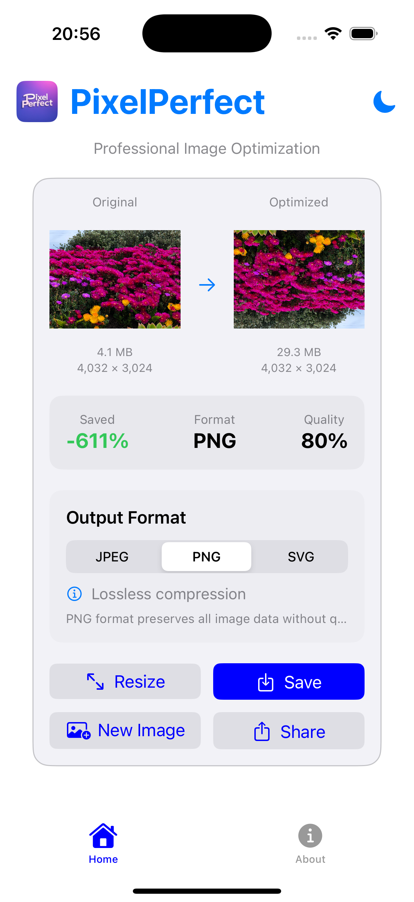
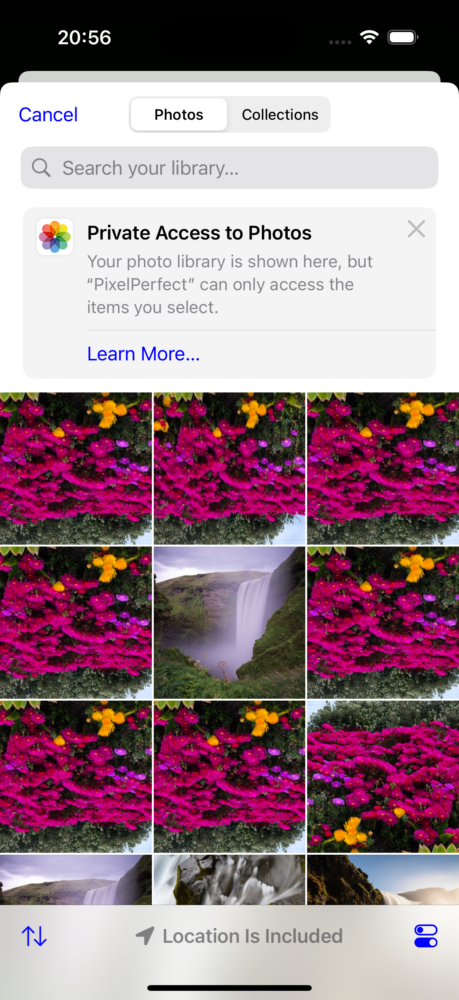
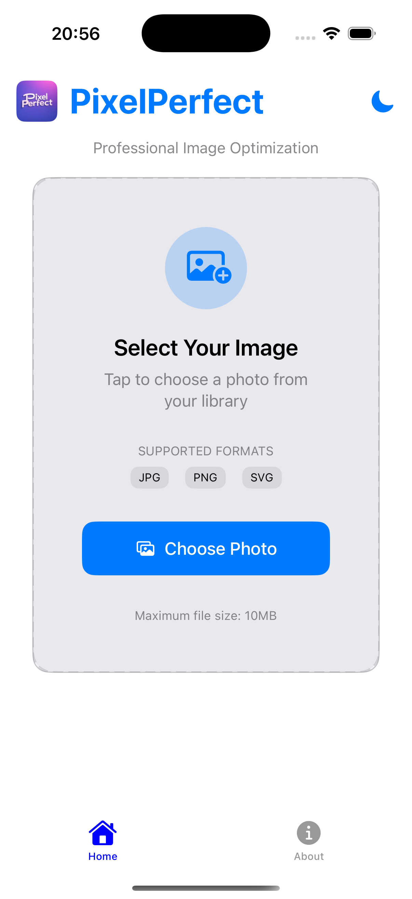

# PixelPerfect

**Professional Image Optimization Suite**

A powerful cross-platform image optimization tool designed for professionals and enthusiasts who demand the highest quality results. PixelPerfect provides advanced compression algorithms that ensure maximum file size reduction while preserving visual quality.

## 🚀 Features

- **Smart Compression**: Advanced algorithms that maintain image quality while reducing file size
- **Aspect Ratio Lock**: Intelligent resizing that preserves original proportions
- **Multiple Formats**: Support for JPEG, PNG, and SVG formats with optimized output
- **Real-time Preview**: Side-by-side comparison of original vs optimized images
- **Detailed Analytics**: Comprehensive statistics on compression ratio and space saved
- **Cross-Platform**: Available on macOS, iOS, and Android
- **Modern UI**: Beautiful interfaces with light and dark mode support

## 📱 Platforms

### macOS
Native macOS application built with SwiftUI
- **Location**: `./PixelPerfect/`
- **Requirements**: macOS 12.0+ (Monterey)
- **Architecture**: Universal (Intel & Apple Silicon)

### iOS
Native iOS application built with SwiftUI
- **Location**: `./PixelPerfect iOS/`
- **Requirements**: iOS 15.0+
- **Devices**: iPhone and iPad supported

### Android
Native Android application built with Jetpack Compose
- **Location**: `./PixelPerfect Android/`
- **Requirements**: Android 7.0+ (API 24)
- **Architecture**: Universal (ARM64, x86_64)

## 🛠 Build Instructions

### macOS & iOS
1. Open the respective `.xcodeproj` file in Xcode
2. Select your target device/simulator
3. Build and run (⌘+R)

**Requirements:**
- Xcode 14.0+
- Swift 5.7+
- macOS 12.0+ for development

### Android
1. Open the `PixelPerfect Android` folder in Android Studio
2. Sync Gradle files
3. Select your target device/emulator
4. Build and run

**Requirements:**
- Android Studio Arctic Fox or newer
- Kotlin 1.8+
- Android SDK 24+

## 📸 Screenshots

| Platform | Home Screen | Processing | Results |
|----------|-------------|------------|---------|
| macOS |  |  |  |
| iOS |  |  |  |
| Android |  |  |  |

## 🔧 Technical Details

### Core Features
- **Image Processing Engine**: Custom algorithms optimized for each platform
- **Format Support**: JPEG, PNG, SVG with lossless and lossy compression
- **Performance**: Optimized for real-time processing with minimal memory usage
- **Quality Preservation**: Advanced algorithms maintain visual fidelity

### Architecture
- **macOS/iOS**: SwiftUI with Combine framework
- **Android**: Jetpack Compose with Kotlin Coroutines
- **Shared Logic**: Platform-specific implementations with consistent UX

## 📋 Version History

### v1.0.0 (Current)
- Initial release
- Support for JPEG, PNG, SVG formats
- Real-time compression with quality adjustment
- Aspect ratio lock functionality
- Dark/Light mode support
- Cross-platform feature parity

## 🤝 Contributing

Contributions are welcome! Please feel free to submit a Pull Request.

### Development Setup
1. Clone the repository
2. Choose your platform directory
3. Follow the build instructions above
4. Make your changes
5. Submit a pull request

### Code Style
- **Swift**: Follow Swift API Design Guidelines
- **Kotlin**: Follow Kotlin Coding Conventions
- **UI**: Maintain consistency with platform design guidelines

## 📄 License

Copyright © 2025 PixelPerfect. All rights reserved.

This project is proprietary software. Unauthorized copying, modification, distribution, or use is strictly prohibited.

## 📞 Support

For support, bug reports, or feature requests, please open an issue in this repository.

---

**Built with ❤️ using modern development practices**
- SwiftUI & Combine (macOS/iOS)
- Jetpack Compose & Kotlin Coroutines (Android)
- Material Design & Human Interface Guidelines
